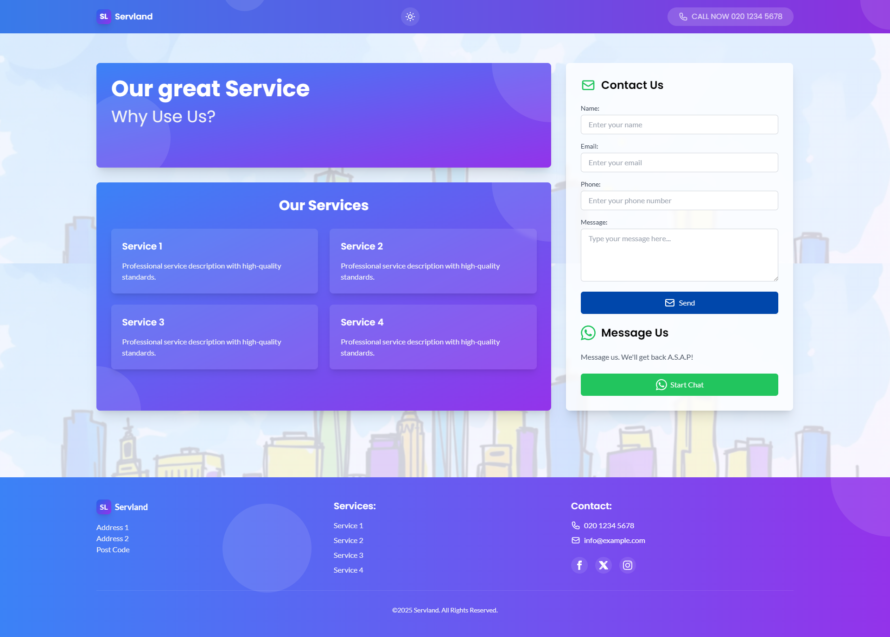

# Servland - Business Landing Page Astro Theme


[](https://astro.build)
[](https://tailwindcss.com)



A modern, responsive, and accessible theme built with Astro and Tailwind CSS, perfect for service-based businesses and professional portfolios.

## 🚀 Features

- ⚡️ **Lightning Fast**: Built with Astro for optimal performance
- 🌙 **Dark Mode**: Elegant dark mode support with system preference detection
- 📱 **Fully Responsive**: Looks great on all devices
- 🎨 **Modern Design**: Clean and professional business landing page
- 🔍 **SEO Optimized**: Meta tags, Open Graph, Twitter Cards
- 📨 **Contact Form**: Secure form handling with EmailJS and reCAPTCHA
- 🌅 **Parallax Effects**: Smooth scrolling parallax background
- 🎯 **Analytics Ready**: Easy to add your analytics code
- ♿️ **WCAG 2.1 Accessible**: ARIA labels, keyboard navigation, screen reader friendly
- 📧 **Cookie Consent**: GDPR compliant cookie notice
- 🖼️ **Animated Background**: Gradient circles with blur effects
- 🔝 **Smooth Scroll Navigation**: Smooth scroll-to-top functionality

## 🛠️ Tech Stack

- [Astro](https://astro.build)
- [Tailwind CSS](https://tailwindcss.com)
- [TypeScript](https://www.typescriptlang.org/)
- [EmailJS](https://www.emailjs.com/) (for form handling)

## 📦 Project Structure

```text
/
├── public/
│   ├── favicon.ico
│   ├── robots.txt
│   └── sitemap.xml
├── src/
│   ├── components/
│   │   ├── ContactForm.astro
│   │   └── ...
│   ├── layouts/
│   │   └── Layout.astro
│   ├── lib/
│   │   └── send-email.ts
│   ├── pages/
│   │   ├── api/
│   │   │   └── contact.astro
│   │   └── index.astro
│   └── styles/
│       └── global.css
└── package.json
```

## 🚀 Getting Started

1. **Clone the theme**
   ```bash
   git clone https://github.com/locobean/servland.git my-website
   cd my-website
   ```

2. **Install dependencies**
   ```bash
   npm install
   ```

3. **Configure environment variables**
   ```bash
   cp .env.example .env
   ```
   Then edit `.env` and add your EmailJS and reCAPTCHA credentials.

4. **Start development server**
   ```bash
   npm run dev
   ```

## 📧 Contact Form Setup

1. Create an account at [EmailJS](https://www.emailjs.com/)
2. Create an email service and template
3. Get your EmailJS credentials:
   - Service ID
   - Template ID
   - User ID (Public Key)
4. Set up [reCAPTCHA v2](https://www.google.com/recaptcha)
5. Add credentials to your `.env` file

## 🎨 Customization

### Colors
The theme uses a custom color palette defined in `tailwind.config.cjs`. Modify the colors to match your brand:

```js
colors: {
  blue: {...},
  purple: {...},
  // Add your colors here
}
```

### Components

#### 1. Layout (`src/layouts/Layout.astro`)
- Main layout component
- Handles meta tags and SEO
- Includes dark mode setup
- Font loading optimization

#### 2. ParallaxBackground (`src/components/ParallaxBackground.astro`)
- Creates animated background effect
- Gradient circles with blur effects
- Dark mode compatible
- Performance optimized

#### 3. ThemeToggle (`src/components/ThemeToggle.astro`)
- Dark/light mode switching
- Persists user preference
- System preference detection
- Accessible button implementation

#### 4. ScrollToTop (`src/components/ScrollToTop.astro`)
- Smooth scroll-to-top functionality
- Appears after scrolling down
- Animated transitions
- Mobile-friendly

#### 5. CookieConsent (`src/components/CookieConsent.astro`)
- GDPR compliant cookie notice
- User preference persistence
- Responsive design
- Customizable content

### Page Sections

The main page (`src/pages/index.astro`) includes:

1. **Header**
   - Navigation menu with enhanced mobile phone icon
   - Theme toggle
   - Responsive mobile menu

2. **Hero Section**
   - Main heading and subtext
   - Call-to-action buttons
   - Animated background

3. **Services Grid**
   - Service cards
   - Icons and descriptions
   - Hover effects

4. **Contact Form**
   - EmailJS backend integration
   - Form validation
   - Success/error handling
   - reCAPTCHA protection

5. **Footer**
   - Social media links
   - Copyright notice
   - Responsive layout

## 🌙 Dark Mode

- System preference detection
- Manual toggle option
- Persistent user preference
- Smooth transitions
- Optimized color schemes

## 📱 Responsive Design

Breakpoints:
- Mobile: 0-640px
- Tablet: 641-1024px
- Desktop: 1025px+

## ♿️ Accessibility

- ARIA labels
- Keyboard navigation
- Screen reader friendly
- Color contrast compliance
- Focus management
- Reduced motion support

## 🔧 Troubleshooting

Common issues and solutions:

1. **Contact form not working**
   - Check EmailJS configuration
   - Verify reCAPTCHA setup
   - Check server logs
   - Verify security settings

2. **Dark mode not persisting**
   - Clear localStorage
   - Check browser compatibility
   - Verify JavaScript execution

## 📄 License

MIT License - feel free to use for personal or commercial projects.

## 🤝 Contributing

1. Fork the repository
2. Create your feature branch
3. Commit your changes
4. Push to the branch
5. Open a pull request

## 📝 Recent Changes

- Enhanced mobile responsiveness for phone icon in navigation
- Added security notes for EmailJS contact form
- Updated project structure
- Optimized background animations
- Improved dark mode compatibility

## 🙏 Credits

- Icons: [Heroicons](https://heroicons.com)
- Fonts: [Google Fonts](https://fonts.google.com)
  - Lato (400, 700)
  - Poppins (400, 500, 600, 700)
